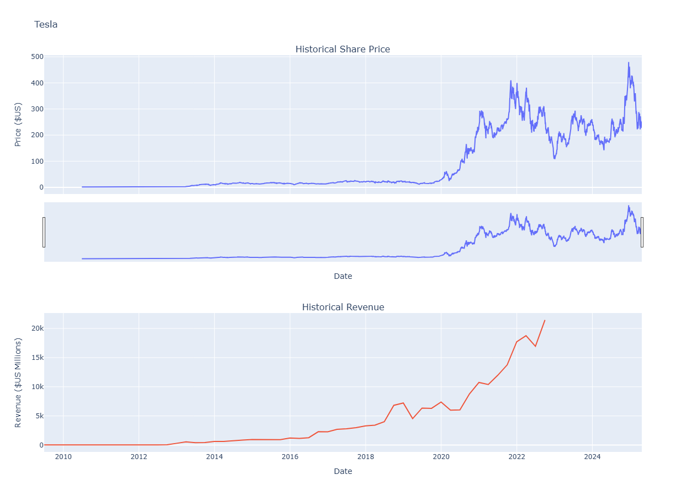
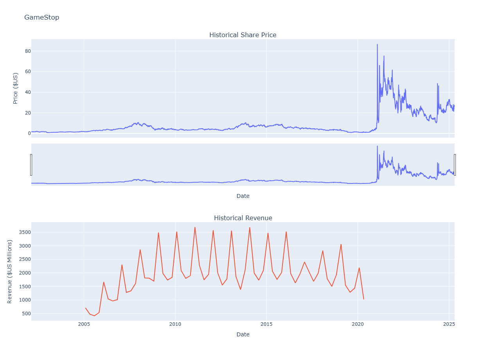

# 📊 Stock & Revenue Analysis: Tesla vs. GameStop

This report presents a visual analysis of historical share prices and revenues for two companies: **Tesla (TSLA)** and **GameStop (GME)**. The visualizations help to explore how stock market performance aligns—or doesn't—with fundamental financial performance over time.

---

## 🚘 Tesla (TSLA)

- **Stock Price:** Tesla’s share price saw modest growth until around 2019, followed by a sharp surge in 2020–2021. The price reached its peak in late 2021 before becoming volatile through 2024–2025.
- **Revenue:** Revenue steadily increased starting in 2018 and continued rising sharply, reflecting strong business performance and expansion.

> **Insight:** Tesla's stock price closely correlates with its rapidly growing revenue after 2018.

---

## 🕹️ GameStop (GME)

- **Stock Price:** GameStop's stock was relatively flat until early 2021, when it experienced a highly publicized and dramatic short squeeze, briefly soaring above $80.
- **Revenue:** Revenue peaked between 2008–2014 and has been declining since, with notable seasonality tied to retail sales.

> **Insight:** The sharp increase in stock price during 2021 was **not supported by revenue growth**, indicating a speculative market event rather than fundamental improvement.

---

## 📌 Summary

| Company | Stock Trend | Revenue Trend | Notable Event |
|--------|--------------|----------------|----------------|
| Tesla  | 📈 Sharp rise post-2019 | 📈 Continuous growth | Business expansion, EV boom |
| GameStop | 📉 Flat → 🔺 Spike in 2021 | 📉 Gradual decline | 2021 Short Squeeze |

---

## 📂 Notes

- Images were generated using historical data and visualized with time-series plots.
- Data includes price (in USD) and revenue (in USD millions) over time.
- This README is designed for a visual and quick overview.

---

